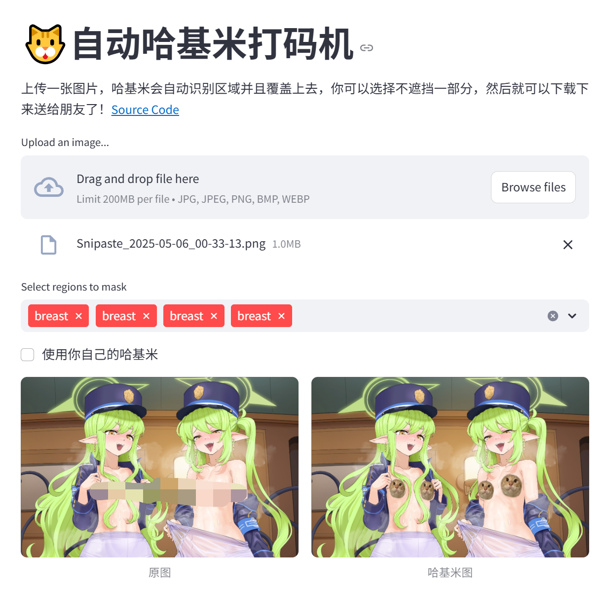

# AutoHajimiMosaic
[](https://huggingface.co/spaces/Frinkleko/auto-hajimi-mosaic) [](https://auto-hajimi-mosaic.streamlit.app/)

一款自动为你的色图进行哈基米马赛克处理的打码器😎
还在因为家里请不到高人，做不出哈基米打码图而感到难过么？想不想让朋友一觉起来听到，"你的图都被我用哈基米祝福了，不用谢"？本项目帮你自动化生成哈基米打码图😎。

[马上开玩Demo!](https://auto-hajimi-mosaic.streamlit.app/) / [玩Huggingface上的Demo!](https://huggingface.co/spaces/Frinkleko/auto-hajimi-mosaic)

## 预览


## By Docker

使用 Docker 可以快速部署 Web UI 或 API 服务器。

1. Web UI
   构建并运行 Web UI 到 8501 口:
   ```bash
   docker-compose up --build webui
   ```


2. API Server
   构建并运行 API 服务器到 8000 口:
   ```bash
   docker-compose up --build api
   ```
   示例请求:
   ```bash
   curl -X POST "http://localhost:8000/process" \
      -F "file=@path/to/your/image.jpg" \
      # 可选
      -F "pattern_image=@path/to/pattern.png" \
      # 可选
      -F "head_image=@path/to/head.png"
      # 可选 (默认是png)
      -F "output_format=jpg"
   ```

## 本地部署

用 pip 装个环境：

```bash
pip install -r requirements.txt
```

还可以去[`huggingface space`](https://huggingface.co/spaces/Frinkleko/auto-hajimi-mosaic/) fork 一下 space 开玩！

### 使用

### Web UI

1. 运行 Streamlit 应用：
   ```bash
   streamlit run app.py
   ```
2. 在浏览器中打开应用，上传图片进行处理。

也可以使用 `gradio`
```bash
python gradio_app.py
```

### 批量处理

1. 确保你的输入图像放在一个文件夹中。
2. 运行批量处理脚本：

   ```bash
   python batch_process.py path/to/input/folder path/to/output/folder --pattern_image path/to/pattern.png --head_image path/to/head.png [--recursive]
   ```

   - `path/to/input/folder`: 输入图像文件夹路径。
   - `path/to/output/folder`: 输出处理后图像的文件夹路径。
   - `--pattern_image`: （可选）填充图案图片路径。
   - `--head_image`: （可选）覆盖头部图片路径。
   - `--recursive`: （可选）包含子文件夹中的图像。

## Todo&缺陷

1. 目前[模型](https://github.com/Forenche/nsfw_detector_annotator/tree/release)对已经进行打码处理，存在遮挡物的部分识别能力弱，也存在缺判的情况。虽然存在[NudeNet](https://github.com/notAI-tech/NudeNet)一类的优秀模型，但是并不支持mask只支持box。后续可以支持更强的模型或者使用SAM+Grounded的方式使用自然语言nsfw描述来获得mask, 然后对目前模型进行微调。#HelpWanted
> 感谢Forenche的nsfw_detector_annotator项目，提供了一个很好的基础模型。
2. 目前填充方法采用仿射变化，和通过自由变化、打点、液化的方式比还不够神人。后续会支持更多自动化的填充方法。
3. 脱离streamlit，更加自由的interactive edit。对于1中可能漏掉的部分，之后可以写一个interactive edit的功能，允许用户手动拖拽旋转填充哈基米。这部分需要js。

## Issues&Contributions
现在的实现非常简单，欢迎大家提出处理失败的图片（全都发给我！！），或者提出更好的处理方法。也欢迎大家提交PR，添加更多的功能和处理方法。

就这样，我去给朋友的图打码了，886~